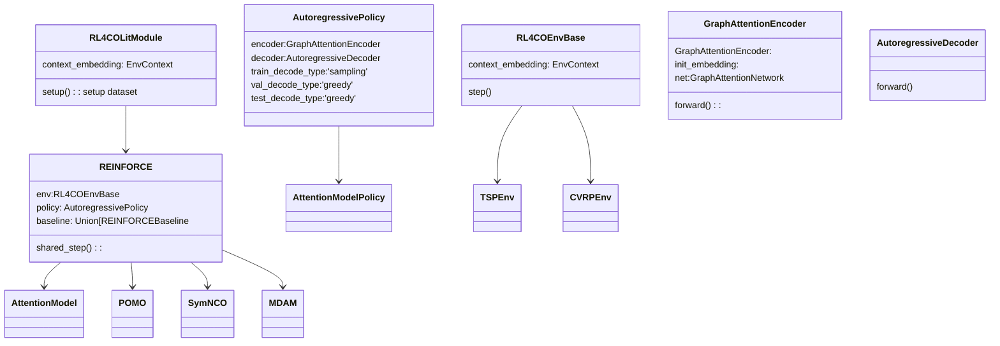

```mermaid
classDiagram
	class RL4COEnvBase{
	step()
	context_embedding: EnvContext
	}
	
    class RL4COLitModule{
	setup(): setup dataset
	context_embedding: EnvContext
	}

    class REINFORCE{
    env:RL4COEnvBase
    policy: AutoregressivePolicy
    baseline: Union[REINFORCEBaseline
	shared_step(): 
	}
    RL4COLitModule-->REINFORCE

    class AttentionModel{
	}
    REINFORCE-->AttentionModel

    class POMO{
	}
    REINFORCE-->POMO
    class SymNCO{
	}
    REINFORCE-->SymNCO
    class MDAM{
	}
    REINFORCE-->MDAM
    class AutoregressivePolicy{
    encoder:GraphAttentionEncoder
    decoder:AutoregressiveDecoder
    train_decode_type:'sampling'
    val_decode_type:'greedy'
    test_decode_type:'greedy'
    }

    class GraphAttentionEncoder{
    GraphAttentionEncoder:
    init_embedding:
    net:GraphAttentionNetwork
    forward():
    }
    class AutoregressiveDecoder{
        forward()
    }
    class AttentionModelPolicy
    AutoregressivePolicy-->AttentionModelPolicy

    class RL4COEnvBase
    class TSPEnv
    class CVRPEnv
    RL4COEnvBase-->TSPEnv
    RL4COEnvBase-->CVRPEnv


```