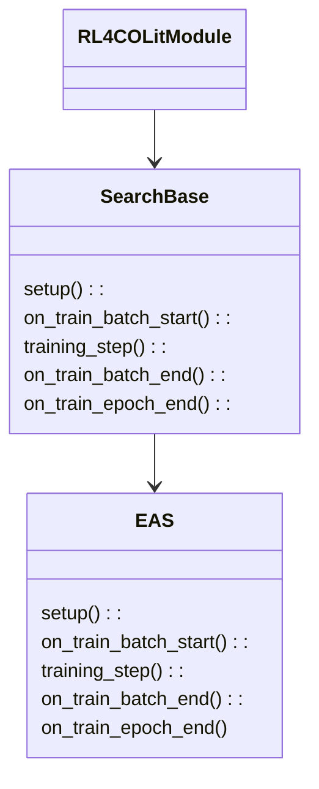

```mermaid
classDiagram
	class EAS{
	setup():
	on_train_batch_start():
    training_step():
    on_train_batch_end():
    on_train_epoch_end()
	}
	
    class SearchBase{
	setup():
	on_train_batch_start():
    training_step():
    on_train_batch_end():
    on_train_epoch_end():
	}

    SearchBase-->EAS
    RL4COLitModule-->SearchBase
    


```