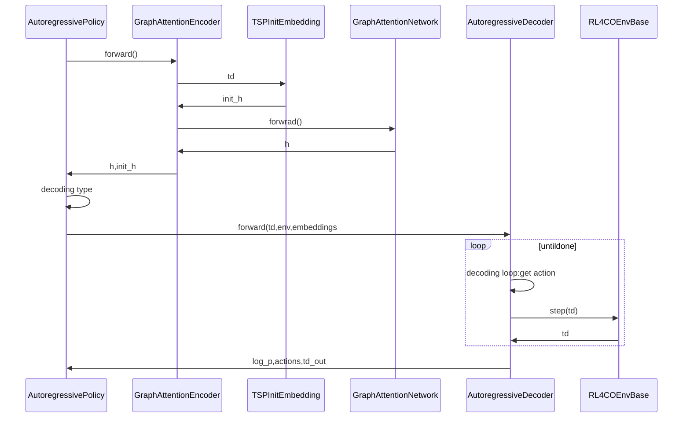

```mermaid
sequenceDiagram
AutoregressivePolicy->>GraphAttentionEncoder:forward()
GraphAttentionEncoder->>TSPInitEmbedding:td
TSPInitEmbedding->>GraphAttentionEncoder:init_h
GraphAttentionEncoder->>GraphAttentionNetwork:forwrad()
GraphAttentionNetwork->>GraphAttentionEncoder:h
GraphAttentionEncoder->>AutoregressivePolicy:h,init_h

AutoregressivePolicy->>AutoregressivePolicy:decoding type
AutoregressivePolicy->>AutoregressiveDecoder:forward(td,env,embeddings
loop untildone
AutoregressiveDecoder->>AutoregressiveDecoder:decoding loop:get action
AutoregressiveDecoder->>RL4COEnvBase:step(td)
RL4COEnvBase->>AutoregressiveDecoder:td
end
AutoregressiveDecoder->>AutoregressivePolicy:log_p,actions,td_out
```