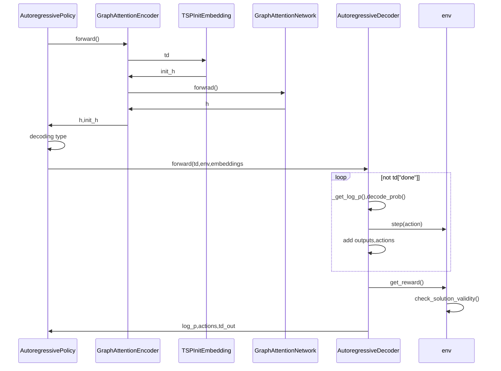

```mermaid
sequenceDiagram
AutoregressivePolicy->>GraphAttentionEncoder:forward()
GraphAttentionEncoder->>TSPInitEmbedding:td
TSPInitEmbedding->>GraphAttentionEncoder:init_h
GraphAttentionEncoder->>GraphAttentionNetwork:forwrad()
GraphAttentionNetwork->>GraphAttentionEncoder:h
GraphAttentionEncoder->>AutoregressivePolicy:h,init_h

AutoregressivePolicy->>AutoregressivePolicy:decoding type
AutoregressivePolicy->>AutoregressiveDecoder:forward(td,env,embeddings
loop not td["done"]
AutoregressiveDecoder->>AutoregressiveDecoder:_get_log_p(),decode_prob()
AutoregressiveDecoder->>env:step(action)
AutoregressiveDecoder->>AutoregressiveDecoder:add outputs,actions
end
AutoregressiveDecoder->>env:get_reward()
env->>env:check_solution_validity()
AutoregressiveDecoder->>AutoregressivePolicy:log_p,actions,td_out
```