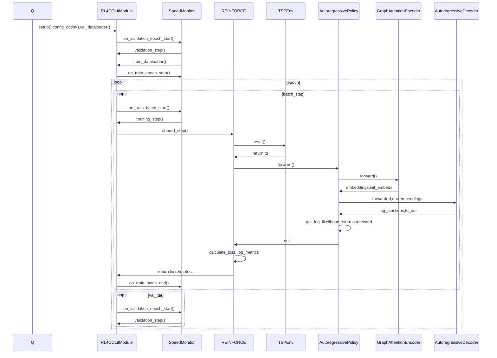

```mermaid
sequenceDiagram
Q->>RL4COLitModule:setup(),config_optim(),val_dataloader()
RL4COLitModule->>SpeedMonitor:on_validation_epoch_start()
SpeedMonitor->>RL4COLitModule:validation_step()

SpeedMonitor->>RL4COLitModule:train_dataloader()
RL4COLitModule->>SpeedMonitor:on_train_epoch_start()

loop epoch
loop batch_step
RL4COLitModule->>SpeedMonitor:on_train_batch_start()
SpeedMonitor->>RL4COLitModule:training_step()
RL4COLitModule->>REINFORCE:shared_step()
REINFORCE->>TSPEnv:reset()
TSPEnv->>REINFORCE:return td
REINFORCE->>AutoregressivePolicy:forward()
AutoregressivePolicy->>GraphAttentionEncoder:forward()
GraphAttentionEncoder->>AutoregressivePolicy:embeddings,init_embeds
AutoregressivePolicy->>AutoregressiveDecoder:forward(td,env,embeddings
AutoregressiveDecoder->>AutoregressivePolicy:log_p,actions,td_out
AutoregressivePolicy->>AutoregressivePolicy:get_log_likelihood,return out:reward
AutoregressivePolicy->>REINFORCE:out
REINFORCE->>REINFORCE:calculate_loss, log_metrics
REINFORCE->>RL4COLitModule:return loss&metrics
RL4COLitModule->>SpeedMonitor:on_train_batch_end()
end

loop val_iter
RL4COLitModule->>SpeedMonitor:on_validation_epoch_start()
SpeedMonitor->>RL4COLitModule:validation_step()
end
end
```